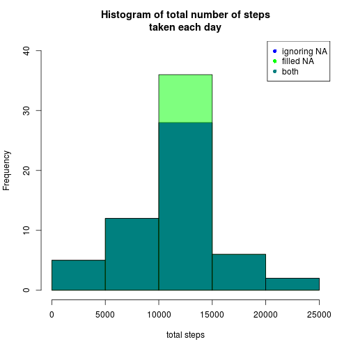
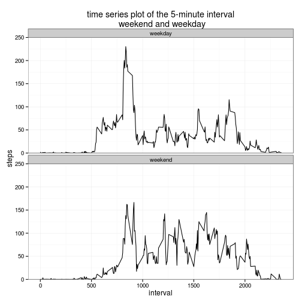

# Reproducible Research: Peer Assessment 1

## Loading and preprocessing the data


```r
library(ggplot2)
data <- read.csv("activity.csv")
data$date <- as.Date(data$date)
data.red <- data[!is.na(data$steps), ]
```


## What is mean total number of steps taken per day?

For this part of the assignment, you can ignore the missing values in the dataset.

1.) Make a histogram of the total number of steps taken each day


```r
data.total.steps <- tapply(X = data.red$steps, data.red$date, sum)
hist(data.total.steps, main = "Histogram of total number of steps\n taken each day (ignoring NAs)", 
    xlab = "total steps")
```

 


2.) Calculate and report the mean and median total number of steps taken per day


```r
mean(data.total.steps)
```

```
## [1] 10766
```

```r
median(data.total.steps)
```

```
## [1] 10765
```


## What is the average daily activity pattern?

1.) Make a time series plot (i.e. type = "l") of the 5-minute interval (x-axis) and 
the average number of steps taken, averaged across all days (y-axis)


```r
data.red.av.steps <- tapply(X = data.red$steps, data.red$interval, mean)
plot(names(data.red.av.steps), data.red.av.steps, type = "l", main = "time series plot of the 5-minute interval\n and the average number of steps (ignoring NAs)", 
    xlab = "interval", ylab = "average number of steps")
```

 


2.) Which 5-minute interval, on average across all the days in the dataset, contains 
the maximum number of steps?


```r
data.red.av.steps[data.red.av.steps == max(data.red.av.steps)]
```

```
##   835 
## 206.2
```


## Imputing missing values

Note that there are a number of days/intervals where there are missing values 
(coded as NA). The presence of missing days may introduce bias into some 
calculations or summaries of the data.

1.) Calculate and report the total number of missing values in the dataset 
(i.e. the total number of rows with NAs)


```r
length(data$steps[is.na(data$steps)]) + length(data$date[is.na(data$date)]) + 
    length(data$interval[is.na(data$interval)])
```

```
## [1] 2304
```


2.) Devise a strategy for filling in all of the missing values in the dataset. The 
strategy does not need to be sophisticated. For example, you could use the 
mean/median for that day, or the mean for that 5-minute interval, etc.


```r
paste("strategy: replace all missing values by the average number of taken steps for each interval, calculated above (data.red.av.steps)")
```

```
## [1] "strategy: replace all missing values by the average number of taken steps for each interval, calculated above (data.red.av.steps)"
```


3.) Create a new dataset that is equal to the original dataset but with the missing 
data filled in.


```r
# strategy: replace all missing values by the average number of taken steps
# for each interval, calculated above (data.red.av.steps)

data.na <- data
data.na$steps[is.na(data$steps)] = data.red.av.steps[match(data[is.na(data$steps), 
    ]$interval, names(data.red.av.steps))]
```


4.) Make a histogram of the total number of steps taken each day and Calculate and 
report the mean and median total number of steps taken per day. 


```r
data.total.steps.na <- tapply(X = data.na$steps, data.na$date, sum)
hist(data.total.steps.na, main = "Histogram of total number of steps\ntaken each day (filled NA)", 
    xlab = "total steps")
```

 

```r

mean(data.total.steps.na)
```

```
## [1] 10766
```

```r
median(data.total.steps.na)
```

```
## [1] 10766
```


Do these values differ from the estimates from the first part of the assignment?
What is the impact of imputing missing data on the estimates of the total daily 
number of steps?


```r
if (mean(data.total.steps.na) == mean(data.total.steps)) {
    paste("No, the means differ not. It is both times", mean(data.total.steps), 
        "steps.")
} else {
    paste("Yes, the means differ with a difference of ", mean(data.total.steps) - 
        mean(data.total.steps), "steps.")
}
```

```
## [1] "No, the means differ not. It is both times 10766.1886792453 steps."
```

```r

if (median(data.total.steps.na) == median(data.total.steps)) {
    paste("No, the medians differ not. It is both times", mean(data.total.steps), 
        "steps.")
} else {
    paste("Yes, the medians differ with a difference of ", median(data.total.steps) - 
        median(data.total.steps.na), "steps.")
}
```

```
## [1] "Yes, the medians differ with a difference of  -1.1886792452824 steps."
```

```r

hist(data.total.steps, ylim = c(0, 40), col = rgb(0, 0, 1), main = "Histogram of total number of steps\ntaken each day", 
    xlab = "total steps")
hist(data.total.steps.na, add = T, col = rgb(0, 1, 0, 0.5))
legend("topright", c("ignoring NA", "filled NA", "both"), pch = c(16, 16, 16), 
    col = c(rgb(0, 0, 1), rgb(0, 1, 0), rgb(0, 0.5, 0.5)))
```

 

```r

print("Yes, there is a difference in the histogram. The bar from 10000 to 15000 steps is higher. This happens, because every NA-day has the same total number of steps, 10766.19. The total number of steps of the other days does not change.")
```

```
## [1] "Yes, there is a difference in the histogram. The bar from 10000 to 15000 steps is higher. This happens, because every NA-day has the same total number of steps, 10766.19. The total number of steps of the other days does not change."
```


## Are there differences in activity patterns between weekdays and weekends?

For this part the weekdays() function may be of some help here. Use the dataset 
with the filled-in missing values for this part.

1.) Create a new factor variable in the dataset with two levels – “weekday” and 
“weekend” indicating whether a given date is a weekday or weekend day.


```r
data.na$weekday <- weekdays(data.na$date)
data.na$weekday[which(data.na$weekday == "Samstag" | data.na$weekday == "Sonntag")] <- "weekend"
data.na$weekday[which(data.na$weekday != "weekend")] <- "weekday"
```


2.) Make a panel plot containing a time series plot (i.e. type = "l") of the 
5-minute interval (x-axis) and the average number of steps taken, averaged 
across all weekday days or weekend days (y-axis).


```r
qplot(interval, steps, data = data.na, facets = weekday ~ ., geom = "blank") + 
    facet_wrap(~weekday, ncol = 1) + theme_bw() + stat_summary(fun.y = "mean", 
    geom = "line") + coord_cartesian(ylim = c(0, 250)) + labs(title = "time series plot of the 5-minute interval\n weekend and weekday")
```

 


